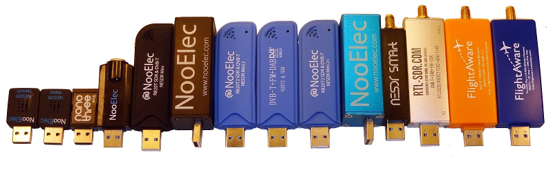
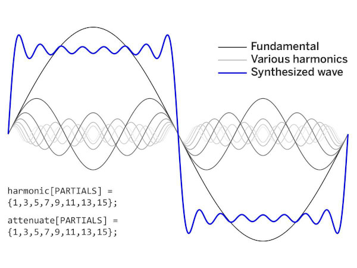

# Hacking Home Automation with Software-Defined Radio

## Andrew Makovec

## About Me
* Senior in Electrical Engineering at Ohio State
* President of Amateur Radio Club at Ohio State (W8LT)

### Overview of Software-Defined Radio
* Traditional radios consist of many hardware components:
    * Mixers: Combine signals
    * Filters: Reject/amplify select components of signals
    * Amplifiers
    * Modulators / Demodulators (modems): "Decode" a signal into a useful format

### Overview of SDR (cont.)

* Traditionally analog, which is expensive
* What if we could do all of the tasks in software?  _We can with software-defined radio_

## RTL-SDR

* Very inexpensive ($10-$30) USB dongle SDR
* Gives us the RF front end to our PC to interface with GNU Radio
* Only receives, can't transmit

## Overview of [RPiTX](https://github.com/F5OEO/rpitx)
* RF transmitter for the Raspberry Pi
    * Only transmits, can't receive
    * If we pair this with an RTL-SDR, we have a full Rx/Tx pair!
* How does it work?
    * RPi's clock generator set to output to a GPIO pin with an "antenna" connected
    * Clock generator frequency is changed thousands of times a second to generate an RF signal

## Overview of [RPiTX](https://github.com/F5OEO/rpitx) (cont.)
* What are it's downsides? (e.g. Why spend $300 on a HackRF if I can just use this?)
    * Beta quality software - even doing something as simple as disabling automatic logic on the RPi broke transmission
    * Very limited output power
    * **Harmonics**

### A (very) Brief Explanation of Why We Have Harmonics

## RPiTX Disclaimer
* LPD433: Internationally recognized frequency band from **433.050 MHz to 434.790 MHz**
    * A license is _not_ required to use this band, as long as transmissions are below 10 mW
* If you don't have a filter on your RPi antenna output, you will be transmitting in all harmonics of this frequency as well

## Overview of Replay Attacks
* Similar to a man-in-the-middle attack, except you're rebroadcasting the _same_ information instead of modifying it
    * Commonly used maliciously to impersonate key fobs to gain access to garage doors, cars, etc.
* We'll be using this today in a non-malicious manner by impersonating remotes for 433 MHz home automation devices

## Live demo of GNU radio intercepting a transmission

## Analysis of Recording
* Modulation: Amplitude Shift Keying (ASK)

## Live demo of a Replay Attack

## Other Open Source SDR Projects
* Skywave Linux
* sdr.hu (check if OSS)
    * KiwiSDR
    * OpenWebRX
* Home Assistant (for tie-in with other devices, make an open source smart home)
* Huginn (open source IFTTT)
